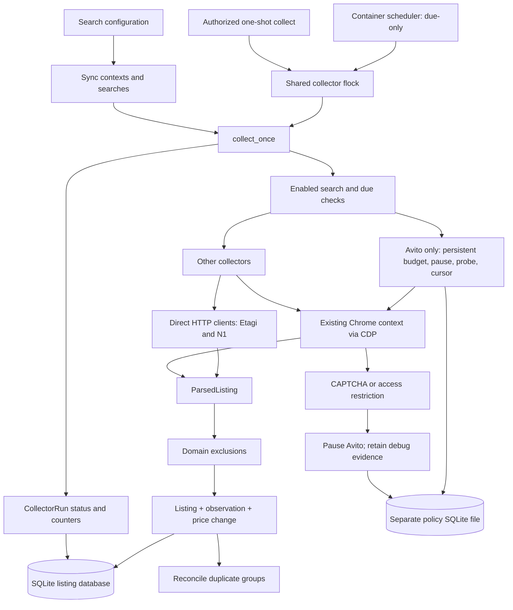
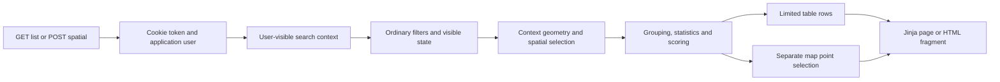

# Project Context

Baseline: `9e3b79d`, 2026-09-12. This map describes current implementation, not a
promise of live availability. Server inventory and executable live procedures have
one owner: [OPERATIONS.md](OPERATIONS.md). No secrets are needed to read this map.

## Environment Selection

| Choice | Evidence | Meaning |
| --- | --- | --- |
| LAN runtime | [compose.lan.yml](../compose.lan.yml) | SQLite, web, shared Chrome/noVNC, scheduler and one-shot collector |
| Legacy local stack | [docker-compose.yml](../docker-compose.yml), [Makefile](../Makefile) | PostgreSQL; unqualified Compose/Make selects this, not LAN |
| Defaults without overrides | [app/config.py](../app/config.py), [.env.example](../.env.example) | Still PostgreSQL; do not infer deployed DB from these defaults |
| Offline checks | [pyproject.toml](../pyproject.toml), [tests](../tests) | Fixture/temp-DB tests, no real source requests |

LAN Compose explicitly overrides DATABASE_URL and binds the data directory. A git
branch alone does not select an environment. Before live work, follow the inventory
and deployment acceptance rules in OPERATIONS; do not derive a host from this map.
Never dump `.env`, cookies, password files, browser profiles or raw database payloads
to establish context. Inspect only non-secret settings needed for the task.

## Component Routing

| Task | Owning implementation | Focused checks |
| --- | --- | --- |
| Scheduler timing, partial/failed runs | [app/runner.py](../app/runner.py): collect_once/search_is_due; [scheduler](../scripts/container-scheduler.sh); [lock wrapper](../scripts/container-collect.sh) | [audit regressions](../tests/test_audit_regressions.py) |
| Browser connection and sessions | [app/browser.py](../app/browser.py): persistent_context; [container browser](../scripts/container-browser.sh); [network watchdog](../scripts/ensure-collector-network.py) | CDP/noVNC live checks require operational authorization |
| Source parsing | [collectors](../collectors), [HTML extraction](../collectors/html_extract.py), [schemas](../app/schemas.py) | Source fixture tests; a successful homepage is not a successful collection |
| Avito limits and recovery | [policy](../services/avito_policy.py): AvitoPolicy; [adapter](../collectors/avito.py): AvitoCollector; runner | [policy tests](../tests/test_avito_policy.py), [adapter tests](../tests/test_avito_collector.py) |
| Persistence and history | [models](../app/models.py), [DB factory](../app/db.py), [ingestion](../services/ingestion.py): upsert_listing; [retention](../services/retention.py) | [ingestion tests](../tests/test_ingestion.py); fresh migrations separately |
| Contexts and exclusions | [context sync](../services/search_contexts.py), [normalization](../services/normalization.py), [geography](../services/geography.py) | Audit regressions, auth tests; missing coordinates are not a valid location |
| List, map, spatial selection and detail | [app/web.py](../app/web.py): listings_page/spatial_listings; [templates](../app/templates) | [auth tests](../tests/test_auth.py), desktop/mobile browser checks |
| Auth and ownership | [services/auth.py](../services/auth.py), web current_user/current_admin | Auth tests, ownership and permission failures |
| Duplicate grouping and scoring | [apartments](../services/apartments.py), [deduplication](../services/deduplication.py), [scoring](../services/scoring.py) | [tests](../tests); retain manual rejection decisions |
| Schema/bootstrap | [migrations](../migrations), [migration environment](../migrations/env.py), runner init_db, web lifespan | Known SQLite bootstrap failure below; do not modify live schema during diagnosis |

## Collection Flow



The runner owns scheduling decisions and persistence; adapters own fetching/parsing.
CLI exit zero can coexist with failed source runs because failures are caught per
search. Read CollectorRun counters/status and retained observations, not exit code
alone. A partial batch is deliberately incomplete and does not deactivate unseen
listings. Generic source errors and explicit access blocks must remain distinct.

Avito's manually requested probe remains subject to budget/cooldown. A useful probe
allows later searches; a failing/interrupted probe keeps the source paused. A probe
validates that page, not every category or future request. The mutable policy is
operational state, not a configuration cache to delete during troubleshooting.

## Request And Identity Flow



User/password authority belongs to this application: password hashes and session
token hashes live in its database. Bootstrap admin settings are used by
bootstrap_admin; they are not credentials for source sites. Source authentication
lives in Chrome's profile. The noVNC password protects remote desktop access and is
neither the application password nor an Avito login.

UI contexts are user-owned application records; collector searches are synchronized
from YAML by the runner. Creating a context in the UI is not evidence that its
searches are collected. Trace create_context and sync_search when changing this contract.

## Invariants And Limits

- Owner requirement: preserve current listings, price history, user flags and browser
  sessions. Retention intentionally prunes redundant history; inspect its policy
  rather than promising that every historical observation remains forever.
- Owner requirement: no shares, wrong room count or out-of-context geography in the
  three-room context. Implementation uses normalization plus context filtering;
  fixture coverage is not proof that every live source address is correct.
- Location evidence: usable coordinates and radius checks live in geography.
  Unknown land locations have a separate view; inferred coordinates are labelled.
- Table limits do not describe market completeness. Map points and spatial filters
  are separate from the first page of table rows, but also have implementation limits.
- No CAPTCHA solving, fingerprint spoofing, proxy rotation or policy reset to avoid
  restrictions. Use manual browser verification and the existing probe mechanism.
- Do not erase or stamp databases to make a migration check green. A backup and
  schema verification precede any authorized live migration/repair.

## Evidence And Open Issues

Evidence from the preceding operator check on 2026-09-12 at baseline `9e3b79d`:

- Live scheduler reported `sqlite+aiosqlite`; CDP was reachable. PostgreSQL was absent
  from the deployed project containers. This is dated evidence, not a live health assertion.
- Avito probe at 16:12 UTC: one page, 14 parsed, 11 accepted, one created, ten updated,
  no price changes, status partial; persisted pause cleared after successful ingestion.
- Offline suite: 135 tests, Ruff and mypy passed. These do not cover all bootstrap paths.
- A fresh temporary SQLite `alembic upgrade head` failed on CREATE EXTENSION pgcrypto
  in [0001](../migrations/versions/0001_initial.py). Revisions
  [0002](../migrations/versions/0002_listing_user_states.py) and
  [0003](../migrations/versions/0003_search_contexts.py) also use PostgreSQL types.
  Existing web/CLI create_all paths explain why a working database does not prove
  that this migration chain supports a clean install. Do not rewrite history casually.
- PostgreSQL drivers remain unconditional dependencies. README/Make/defaults still
  contain legacy entrypoints. Documentation labels them; runtime cleanup is a separate task.
- [Earlier audit](REVIEW-2026-09-12.md) predates fixes; consult its revision/date before
  treating its findings as current. A complete PostgreSQL install was not re-tested.

## Offline Context Checks

From the project root, using a real interpreter in the existing venv:

```text
python -m pytest tests/test_project_context.py -q
python -m pytest -q
python -m ruff check .
python -m mypy app collectors services
```

On Windows use `.venv/Scripts/python.exe`; on the server use the interpreter from
OPERATIONS only when live access is separately authorized. Tests check reference
integrity, not live availability or architectural correctness. No map executes
commands automatically. For fresh-agent evaluation use [prompts](CONTEXT_PROMPTS.md)
and keep the [reviewer rubric](CONTEXT_RUBRIC.md) separate. No independent agent
evaluation was performed during this initialization.
